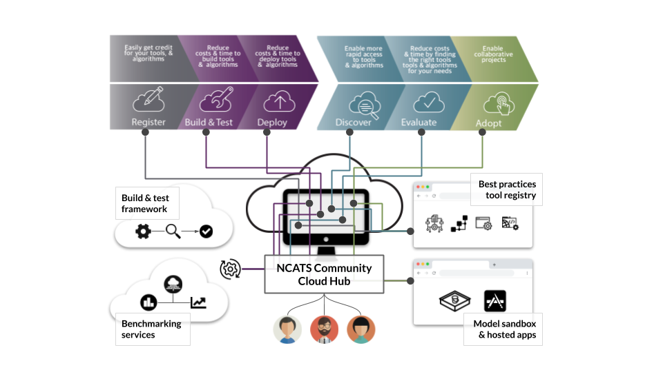

## Our vision
Computational technologies and tools are vital to clinical and translational research; however Hubs currently develop, deploy, and manage these key resources independently. As a result, these processes are tedious, costly, and heterogeneous. This core will address this by establishing a common tool and cloud computing architecture, and will provide CTSA hubs with an affordable, easy to use, and scalable deployment paradigm. We envision that such an approach will support a robust ecosystem that demonstrates the use of shared tools and platforms for the collaborative analysis of clinical data. Hubs can easily promote and deploy their own products as well as adopt others products, thereby transcending long-standing “boundaries” and solving common and recurring information needs.

Use our [CD2H onboarding process](http://bit.ly/cd2h-onboarding-form) to select the project(s) you would like to join, learn more about, or contribute to.

## Explore Our Work and Engage With Us
#### Review our cloud architecture proposal.
Review a draft of our [CD2H-NCATS Cloud Architecture proposal](https://docs.google.com/presentation/d/1O8C0Kj5AtX-69C0eY79zaftAQFPYAWAELAZ2Y7-vnnA/edit#slide=id.g5e2ce0d5ce_5_0) and provide feedback using our [Architecture Response Form](https://docs.google.com/document/d/10xCBV5jCVd5ALNT_bomQVtRARkRpBRj3U6OD7QNsovs/edit).
#### Request CD2H-NCATS Cloud Resources.
Use our NCATs Cloud Resources [intake form](https://forms.gle/YdZHUSR9NT2ktt1EA) to request Amazon Web Services for deployment of your tool or service. 
#### Browse our CD2H Labs
Visit our [tool repository](http://labs.cd2h.org/labs/), where you can browse and access our software and tools under-development.
#### Participate in our EHR DREAM Challenge
Participate in our recently launched [EHR DREAM Challenge](http://synapse.org/ehr_dream_challenge_mortality), where you can build and test algorithms for predicting patient mortality. Also, read our [blog post](https://ctsa.ncats.nih.gov/cd2h/blog/toward-a-distributed-benchmarking-ecosystem-using-electronic-healthcare-data/) describing the EHR Challenge, and how this aligns with our wider mission to develop a data and algorithm ecosystem. 

### Exemplar cloud resources:
#### Competitions
Access our [Competitions platform](http://competitions.cd2h.org) to run NIH-style grant competitions across the CTSA including pilot projects and research awards. This platform is also an example of how to successfully deploy a Software As A Service (Saas) into the [NCATs cloud environment](https://forms.gle/YdZHUSR9NT2ktt1EA), and to leverage [Federated Authentication](https://drive.google.com/open?id=1DclEZEwvEasCX0QfBeJZOTlRB0VYCoOQ). 
#### LEAF
Leaf is a powerful, lightweight web application for querying clinical data. Leaf helps query clinical databases of nearly any data model for cohort estimation and data extraction. Leaf seamlessly integrates with clinical databases and existing enterprise authentication systems to unleash the potential of translational biomedical research. Access the [source code](github.com/uwrit/leaf) or view a [video demo](https://www.youtube.com/watch?v=ZuKKC7B8mHI).

### Ongoing efforts:
* Integrate your github repos with NCATS continuous integration / continuous deployment system (Jenkins)
* Best practices guidebook for developing, deploying, (automated) testing, and evaluating CTSA tools.
* Support for an NLP "sandbox" using the NCATs cloud, in collaboration with the [iDTF Text Analytics and De-Id WG](https://clic-ctsa.org/sites/default/files/Text%20Analytics%20and%20De-Identification%20WG%20Charter%20for%20approval12.07.18.pdf)

### All resources:

* [CD2H Website](https://ncats.nih.gov/pubs/features/cd2h)
* [CD2H-NCATS Cloud deployment process workflow](https://docs.google.com/presentation/d/1GYGgSbglIuHxAd0qkYRXbcWL4g1jmB-N-gMlQoYQMIc/edit?usp=sharing)
* [CD2H-NCATS Cloud deployment checklist](https://docs.google.com/presentation/d/1rVAgHFmiKszxF-_VJLvY9JK91Lg3IjwAV8kM78qzuX4/edit?usp=sharing)
* [CD2H-NCATS Architecture Overview](https://docs.google.com/presentation/d/1O8C0Kj5AtX-69C0eY79zaftAQFPYAWAELAZ2Y7-vnnA/edit#slide=id.g5e2ce0d5ce_5_0)
* [CD2H-NCATS Architecture Request for Feedback Form](https://docs.google.com/document/d/10xCBV5jCVd5ALNT_bomQVtRARkRpBRj3U6OD7QNsovs/edit)
* [CD2H-NCATS Federated Authentication (UNA) Overview](https://drive.google.com/open?id=1DclEZEwvEasCX0QfBeJZOTlRB0VYCoOQ)
* CD2H-NCATS Governance Process (Source and link TBD)

## GitHub Repos:

* [Tool-Cloud-Infrastructure Core GitHub repo](https://github.com/data2health/tools-cloud-infrastructure)
* [Cloud-Tool-Architecture project GitHub repo](https://github.com/data2health/Cloud-Tool-Architecture)
* [Competitions project GitHub repo](https://github.com/data2health/competitions-project)
* [EHR Dream Challenge project GitHub repo](https://github.com/data2health/DREAM-Challenge)

